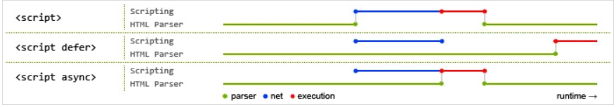

#script元素

###script元素6个属性

async--可选--表示立即下载脚本，但不阻碍页面中其他操作（异步）

charset--可选--src属性指定的代码字符集

defer--可选--脚本可以延迟到文档完全被解析和显示之后再执行（相当于在body标签之后写的script标签）

src--可选--引入外部脚本

type--可选--脚本语言内容类型，默认text/javascript

###async和defer区别

async不能保证延迟执行的脚本顺序，defer延迟加载脚本按照顺序执行

async在脚本加载完成之后就会执行，defer会在文档最后执行

